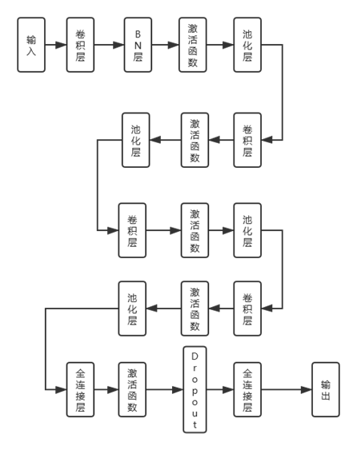
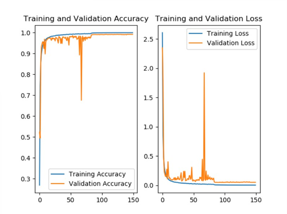

# 验证码识别

## 1 项目简介

本项目只针对字符型验证码，使用了TensorFlow 2.1 中的Keras模块。

### 1.1 文件介绍

|        文件名         | 说明                                 |
| :-------------------: | ------------------------------------ |
|        main.py        | 图片预处理、模型训练评估、绘制曲线图 |
| captcha_generation.py | 验证码图片的生成                     |

### 1.2 依赖

```python
pip install -r requirements.txt
```


## 2 数据集的制作与预处理

模型训练的数据由Python第三方库[Captcha](https://pypi.org/project/captcha/)生成。

对图片进行了简单的预处理（灰度化、归一化），目的是缩短模型训练的时间。

## 3 模型的训练

### 3.1 模型结构



### 3.2 LOSS&Accuracy曲线

- 模型在epochs=100时(训练集规模：55775张)趋于稳定。
- epochs=50-100时震荡的原因大概是由于学习率的调整引起的。
- 平均每轮的训练时间为39s，150轮次的时间大约为1个半小时。(训练平台：NVIDIA GTX 1050)
- 模型准确率为99%。

